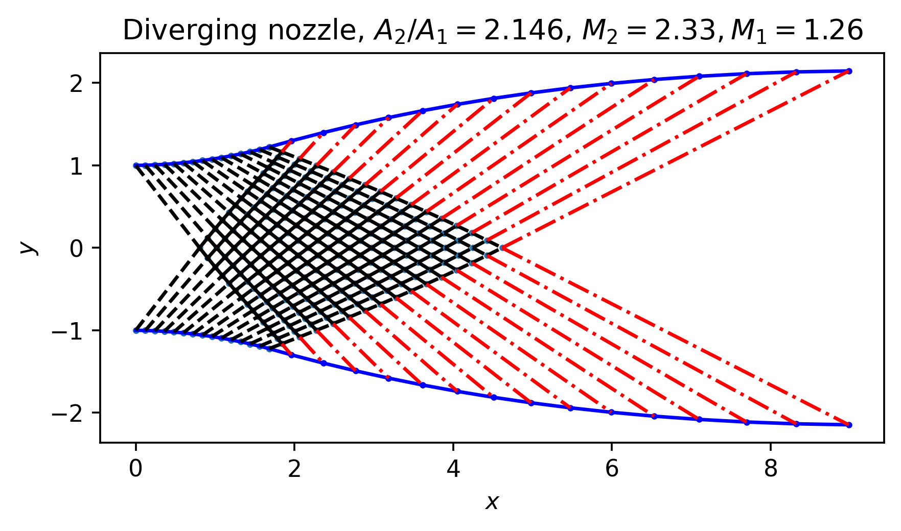
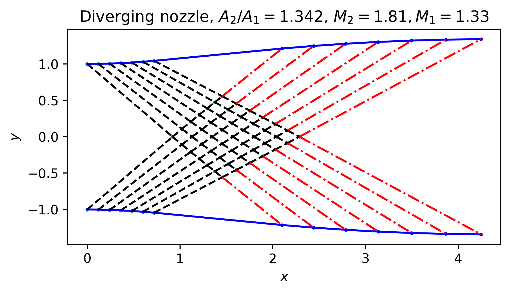

# AeroMOW: Designing supersonic diverging nozzle

AeroMOW uses the method of waves to design the supersonic diverging nozzle. The air enters into the nozzle is sonic of supersonic, leaving the nozzle with a higher Mach number. More importantly, the method of waves ensures that the air flow at the outlet is uniform, consisting no waves. The method of waves includes the following crucial steps:

* Defining the expansion part consists of multiple sudden expansions with deflection angle.
* Calculate the deflection angle and the Mach number in every region splitted by the expansion waves.
* Starting from the first to sudden expansion point, march downstream to get the coordinates of all other interior nodes where the expansion wave intereacts. 
* Construct the nozzle's wave-elimination part based on the downstream-most nodes.

To use this code, simply writes:
```python
import MOW

# The deflection angle of every expansion wave
dtheta = 1.0

# The interval between every expansion
dx = 0.12

# The half width of the inlet
dy = 1.0

# The total number of expansions of one side
nwave = 7

# The P-M angle at the inlet
nu0 = 7.0

# construct the nozzle instance
noz = MOW.nozzle(dtheta, dx, dy, nwave, nu0 = nu0)

# march downstream to get every interaction node
noz.march()

# compute the shape of wave elimination part 
noz.elimination()
```

To visualize the result, see `test.ipynb`. Several nozzles designed by the program are shown here:



